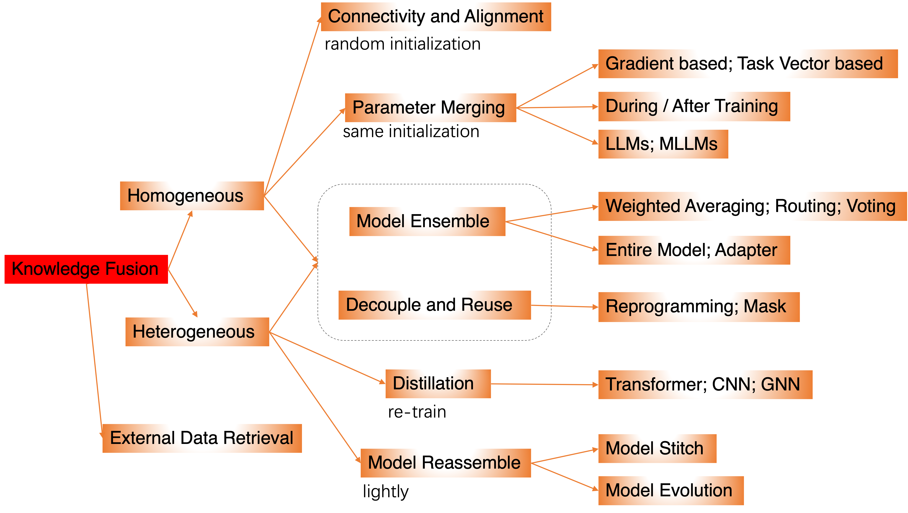

# Awesome-Knowledge-Fusion

<!-- > [!TIP] -->
If you have any questions about the library, please feel free to contact us.
Email: duguodong7@gmail.com

---

A comprehensive list of papers about **'[Knowledge Fusion: The Integration of Model Capabilities.]'**.

## Abstract
> As the comprehensive capabilities of foundational large models rapidly improve, similar general abilities have emerged across different models, making capability transfer and fusion between them more feasible. Knowledge fusion aims to integrate existing LLMs of diverse architectures and capabilities into a more powerful model through efficient methods such as knowledge distillation, model merging, mixture of experts, and PEFT, thereby reducing the need for costly LLM development and adaptation. We provide a comprehensive overview of model merging methods and theories, covering their applications across various fields and scenarios, including LLMs, MLLMs, image generation, model compression, continual learning, and more. Finally, we highlight the challenges of knowledge fusion and explore future research directions.

******

## Framework
- [Awesome-Knowledge-Fuse](#awesome-model-merging-methods-theories-applications)
  * [1. Connectivity and Alignment](#1-connectivity-and-alignment)
    + [1.1 Model Connectivity](#11-model-connectivity)
    + [1.2 Weight Alignment](#12-weight-alignment)
  * [2. Parameter Merging](#2-parameter-merging)
    + [2.1 Merging Methods](#21-merging-methods)
      - [Gradient based](#gradient-based)
      - [Task Vector based](#task-vector-based)
    + [2.2 During or After Training](#22-during-or-after-training)
      - [During Training](#during-training)
      - [After Training](#after-training)
    + [2.3 For LLMs and MLLMs](#23-for-llms-and-mllms)
      - [For LLMs](#for-llms)
      - [For Multimodal Language Models](#for-multimodal-language-models)
  * [3. Model Ensemble](#3-model-ensemble)
    + [3.1 Ensemble Methods](#31-ensemble-methods)
      - [Weighted Averaging](#weighted-averaging)
      - [Routing](#routing)
    + [3.2 Ensemble Object](#32-ensemble-object)
      - [Entire Model](#entire-model)
      - [Adapter](#Adapter)
  * [4. Decouple and Reuse](#4-decouple-and-reuse)
    + [4.1 Reprogramming](#41-reprogramming)
    + [4.2 Mask](#42-mask)
  * [5. Distillation](#5-distillation)
    + [5.1 Transformer](#51-transformer)
    + [5.2 CNN](#52-cnn)
    + [5.3 GNN](#53-gnn)
  * [6. Model Reassemble](#6-model-reassemble)
    + [6.1 Model Evolution](#61-model-evolution)
  * [7. Others](#7-others)
    + [7.1 External Data Retrieval](#71-external-data-retrieval)
    + [7.2 Multi-Objective Optimization](#72-multi-objective-optimization)
    + [7.4 Other Surveys](#74-other-survyes)
----------

## 1. Connectivity and Alignment
#### 1.1 Model Connectivity
| **Paper Title**                                              |                             Code                             |    **Pub & Date**    |
| :----------------------------------------------------------- | :----------------------------------------------------------: | :------------------: |
| [Rethink Model Re-Basin and the Linear Mode Connectivity](https://arxiv.org/pdf/2402.05966) | [rethink](https://github.com/XingyuQu/rethink-re-basin) | **ArXiv** 24.02 |
| [Layerwise linear mode connectivity](https://openreview.net/pdf?id=LfmZh91tDI) | [Layerwise](https://github.com/link-er/layer-wise-lmc) | **ICLR** 2024 |
| [Proving linear mode connectivity of neural networks via optimal transport](https://arxiv.org/pdf/2310.19103) | [OT_LMC](https://github.com/damienferbach/OT_LMC/tree/main) | **AISTATS** 2024 |
| [Re-basin via implicit Sinkhorn differentiation](https://openaccess.thecvf.com/content/CVPR2023/papers/Pena_Re-Basin_via_Implicit_Sinkhorn_Differentiation_CVPR_2023_paper.pdf) | [Re-Basin]( https://github.com/fagp/sinkhorn-rebasin) | **CVPR** 2023 |
| [Git Re-Basin: Merging Models modulo Permutation Symmetries](https://arxiv.org/pdf/2209.04836) | [Git Re-Basin](https://github.com/samuela/git-re-basin) | **ICLR** 2023 |
| [Plateau in Monotonic Linear Interpolation--A "Biased" View of Loss Landscape for Deep Networks](https://arxiv.org/pdf/2210.01019)| - | **ICLR** 2023 |
| [Linear Mode Connectivity of Deep Neural Networks via Permutation Invariance and Renormalization](https://openreview.net/pdf?id=gU5sJ6ZggcX)| - | **ICLR** 2023 |
| [Going beyond linear mode connectivity: The layerwise linear feature connectivity](https://papers.nips.cc/paper_files/paper/2023/file/bf3ee5a5422b0e2a88b0c9c6ed3b6144-Paper-Conference.pdf) | [LLFC](https://github.com/zzp1012/LLFC) |**NeurIPS** 2023 |
| [The role of permutation invariance in linear mode connectivity of neural networks](https://openreview.net/pdf?id=dNigytemkL) | [PI](https://github.com/rahimentezari/PermutationInvariance) | **ICLR** 2022 |
| [What can linear interpolation of neural network loss landscapes tell us?](https://arxiv.org/pdf/2106.16004) | - | **ICML** 2022 |
| [Loss Surface Simplexes for Mode Connecting Volumes and Fast Ensembling](https://proceedings.mlr.press/v139/benton21a/benton21a.pdf) | [LSS](https://github.com/g-benton/loss-surface-simplexes) | **ICML** 2021 |
| [Analyzing Monotonic Linear Interpolation in Neural Network Loss Landscapes](https://proceedings.mlr.press/v139/lucas21a/lucas21a.pdf) | - | **ICML** 2021 |
| [Geometry of the Loss Landscape in Overparameterized Neural Networks: Symmetries and Invariances](https://proceedings.mlr.press/v139/simsek21a/simsek21a.pdf)| - | **ICML** 2021 |
| [Linear Mode Connectivity and the Lottery Ticket Hypothesis](https://proceedings.mlr.press/v119/frankle20a/frankle20a.pdf) | - | **ICML** 2020 |
| [Loss Surfaces, Mode Connectivity, and Fast Ensembling of DNNs](https://papers.nips.cc/paper_files/paper/2018/file/be3087e74e9100d4bc4c6268cdbe8456-Paper.pdf)| [DNN](https://github.com/timgaripov/dnn-mode-connectivity) | **NeurIPS** 2018 |

#### 1.2 Weight Alignment
| **Paper Title**                                              |                             Code                             |    **Pub & Date**    |
| :----------------------------------------------------------- | :----------------------------------------------------------: | :------------------: |
| [Equivariant Deep Weight Space Alignment](https://openreview.net/pdf/6d437eeb362255b4b2d75a5c6847880fb4a00e3c.pdf) | [EDWSA](https://github.com/AvivNavon/deep-align) | **ICML** 2024 |
| [Harmony in diversity: Merging neural networks with canonical correlation analysis](https://openreview.net/pdf?id=XTr8vwAr2D) | [CCA Merge](https://github.com/shoroi/align-n-merge) | **ICML** 2024 |
| [Transformer fusion with optimal transport](https://arxiv.org/pdf/2310.05719) | [TF](https://github.com/graldij/transformer-fusion) | **ICLR** 2024 |
| [ZipIt! Merging Models From Different Tasks Without Training](https://openreview.net/pdf?id=LEYUkvdUhq) | [ZipIt](https://github.com/gstoica27/ZipIt) | **ICLR** 2024 |
| [Training-Free Pretrained Model Merging](https://openaccess.thecvf.com/content/CVPR2024/papers/Xu_Training-Free_Pretrained_Model_Merging_CVPR_2024_paper.pdf) | [TFPMM](https://github.com/zju-vipa/training_free_model_merging.) |**CVPR** 2024  |
| [Merging LoRAs like Playing LEGO: Pushing the Modularity of LoRA to Extremes Through Rank-Wise Clustering](https://arxiv.org/pdf/2409.16167)| - | **ArXiv** 24.09 |
| [C2M3: Cycle-Consistent Multi Model Merging](https://arxiv.org/pdf/2405.17897) | [CCM](https://github.com/crisostomi/cycle-consistent-model-merging) | **ArXiv** 24.05 |
| [REPAIR: REnormalizing Permuted Activations for Interpolation Repair](https://openreview.net/pdf?id=gU5sJ6ZggcX) |[REPAIR](https://github.com/KellerJordan/REPAIR)  | **ICLR** 2023 |
| [Optimizing mode connectivity via neuron alignment](https://arxiv.org/pdf/2009.02439) | [Neu-Align](https://github.com/IBM/NeuronAlignment) | **NeurIPS** 2020 |
| [Model fusion via optimal transport](https://proceedings.neurips.cc/paper/2020/file/fb2697869f56484404c8ceee2985b01d-Paper.pdf) | [otfusion](https://github.com/sidak/otfusion) | **NeurIPS** 2020 |
| [Uniform convergence may be unable to explain generalization in deep learning](https://proceedings.neurips.cc/paper_files/paper/2019/file/05e97c207235d63ceb1db43c60db7bbb-Paper.pdf) | - | **NeurIPS** 2019 |
| [Explaining landscape connectivity of low-cost solutions for multilayer nets](https://proceedings.neurips.cc/paper_files/paper/2019/file/46a4378f835dc8040c8057beb6a2da52-Paper.pdf)| - | **NeurIPS** 2019 |
| [Essentially no barriers in neural network energy landscape](https://proceedings.mlr.press/v80/draxler18a/draxler18a.pdf) | [AutoNEB](https://github.com/fdraxler/PyTorch-AutoNEB) | **ICML** 2018 |
| [Weight Scope Alignment: A Frustratingly Easy Method for Model Merging](https://arxiv.org/pdf/2408.12237) | [FedExp](https://github.com/Divyansh03/FedExP) | **ArXiv** 24.08 |

## 2. Parameter Merging
### 2.1 Merging Methods
#### Optimization based

| **Paper Title**                                              |                             Code                             |    **Pub & Date**    |
| :----------------------------------------------------------- | :----------------------------------------------------------: | :------------------: |
| [XFT: Unlocking the Power of Code Instruction Tuning by Simply Merging<br / Upcycled Mixture-of-Experts](https://aclanthology.org/2024.acl-long.699.pdf) |            [XFT](https://github.com/ise-uiuc/xft)            |     **ACL** 2024     |
| [Model Merging by Uncertainty-Based Gradient Matching](https://openreview.net/pdf?id=D7KJmfEDQP) |   [code](https://github.com/UKPLab/iclr2024-model-merging)   |    **ICLR** 2024     |
| [Merge, Then Compress: Demystify Efficient SMoE with Hints from Its Routing Policy](https://arxiv.org/pdf/2310.01334) |       [MC-SMoE](https://github.com/UNITES-Lab/MC-SMoE)       |    **ICLR** 2024     |
| [Representation Surgery for Multi-Task Model Merging](https://openreview.net/pdf/602906ec02919eb95d78d634321fcba1b68a2f03.pdf) | [Rep-Surgery](https://github.com/EnnengYang/RepresentationSurgery) |    **ICML** 2024     |
| [Erasure Coded Neural Network Inference via Fisher Averaging](https://shiqiang.wang/papers/DJ_ISIT2024.pdf) |                                                              |    **ISIT** 2024     |
| [Fisher Mask Nodes for Language Model Merging](https://arxiv.org/pdf/2403.09891) | [Fisher-nodes](https://github.com/thennal10/fisher-nodes-merging) | **LREC-COLING** 2024 |
| [Merging by Matching Models in Task Subspaces](https://arxiv.org/pdf/2312.04339) |           [Mats](https://github.com/r-three/mats)            |    **TMLR** 2024     |
| [Soft merging of experts with adaptive routing](https://arxiv.org/pdf/2306.03745) |          [Smear](https://github.com/r-three/smear)           |    **TMLR** 2024     |
| [SMILE: Zero-Shot Sparse Mixture of Low-Rank Experts Construction From Pre-Trained Foundation Models](https://arxiv.org/pdf/2408.10174) |      [SMILE](https://github.com/tanganke/fusion_bench)       |   **ArXiv** 24.08    |
| [Self-MoE: Towards Compositional Large Language Models with Self-Specialized Experts](https://arxiv.org/pdf/2406.12034) |                                                              |   **ArXiv** 24.06    |
| [Checkpoint Merging via Bayesian Optimization in LLM Pretraining](https://arxiv.org/pdf/2403.19390) |                                                              |   **ArXiv** 24.03    |
| [Dataless Knowledge Fusion by Merging Weights of Language Models](https://openreview.net/pdf?id=FCnohuR6AnM) | [RegMean](https://github.com/bloomberg/dataless-model-merging) |    **ICLR** 2023     |
| [Merging models with fisher-weighted averaging](https://openreview.net/pdf?id=LSKlp_aceOC) |      [Fisher](https://github.com/mmatena/model_merging)      |   **NeurIPS** 2022   |
| [Model fusion via optimal transport](https://proceedings.neurips.cc/paper/2020/file/fb2697869f56484404c8ceee2985b01d-Paper.pdf) |        [Otfusion](https://github.com/sidak/otfusion)         |   **NeurIPS** 2020   |

#### Task Vector based

| **Paper Title**                                              |                             Code                             |  **Pub & Date**  |
| ------------------------------------------------------------ | :----------------------------------------------------------: | :--------------: |
| [Chat Vector: A Simple Approach to Equip LLMs With New Language Chat Capabilities](https://arxiv.org/pdf/2310.04799) |                                                              |   **ACL** 2024   |
| [AdaMerging: Adaptive Model Merging for Multi-Task Learning](https://openreview.net/pdf?id=nZP6NgD3QY) |    [AdaMerging](https://github.com/EnnengYang/AdaMerging)    |  **ICLR** 2024   |
| [Language Models are Super Mario: Absorbing Abilities from Homologous Models as a Free Lunch](https://arxiv.org/pdf/2311.03099) |         [DARE](https://github.com/yule-BUAA/MergeLM)         |  **ICML** 2024   |
| [Localizing Task Information for Improved Model Merging and Compression](https://openreview.net/attachment?id=DWT9uiGjxT&name=pdf) |     [Tall_masks](https://github.com/nik-dim/tall_masks)      |  **ICML** 2024   |
| [Merging Multi-Task Models via Weight-Ensembling Mixture of Experts](https://openreview.net/pdf/2aee8072945cd0485e619dd88c35566610cd5042.pdf) |  [WEMoE](https://github.com/tanganke/weight-ensembling_MoE)  |  **ICML** 2024   |
| [Learning to Route Among Specialized Experts for Zero-Shot Generalization](https://arxiv.org/pdf/2402.05859) |      [Phatgoose](https://github.com/r-three/phatgoose)       |  **ICML** 2024   |
| [Model Tailor: Mitigating Catastrophic Forgetting in Multi-modal Large Language Models](https://arxiv.org/pdf/2402.12048) |                                                              |  **ICML** 2024   |
| [Parameter Competition Balancing for Model Merging](https://arxiv.org/pdf/2410.02396v1) |   [PCB-Merging](https://github.com/duguodong7/pcb-merging)   | **NeurIPS** 2024 |
| [EMR-Merging: Tuning-Free High-Performance Model Merging](https://arxiv.org/pdf/2405.17461) | [EMR_Merging](https://github.com/harveyhuang18/EMR_Merging)  | **NeurIPS** 2024 |
| [Localize-and-Stitch: Efficient Model Merging via Sparse Task Arithmetic](https://arxiv.org/pdf/2408.13656) | [Localize-and-Stitch](https://github.com/yifei-he/Localize-and-Stitch) | **ArXiv** 24.08  |
| [Activated Parameter Locating via Causal Intervention for Model Merging](https://arxiv.org/pdf/2408.09485) |                                                              | **ArXiv** 24.08  |
| [Knowledge Composition using Task Vectors with Learned Anisotropic Scaling](https://arxiv.org/pdf/2407.02880) |         [aTLAS](https://github.com/fredzzhang/atlas)         | **ArXiv** 24.07  |
| [PAFT: A Parallel Training Paradigm for Effective LLM Fine-Tuning](https://arxiv.org/pdf/2406.17923) |                                                              | **ArXiv** 24.06  |
| [DELLA-Merging: Reducing Interference in Model Merging through Magnitude-Based Sampling](https://arxiv.org/pdf/2406.11617) |        [DELLA](https://github.com/declare-lab/della)         | **ArXiv** 24.06  |
| [Twin-Merging: Dynamic Integration of Modular Expertise in Model Merging](https://arxiv.org/pdf/2406.15479) | [Twin-Merging](https://github.com/LZY-the-boys/Twin-Merging) | **ArXiv** 24.06  |
| [MetaGPT: Merging Large Language Models Using Model Exclusive Task Arithmetic](https://arxiv.org/pdf/2406.11385) |                                                              | **ArXiv** 24.06  |
| [Towards Efficient Pareto Set Approximation via Mixture of Experts Based Model Fusion](https://arxiv.org/pdf/2406.09770) | [Pareto_set](https://github.com/tanganke/pareto_set_learning) | **ArXiv** 24.06  |
| [RE-Adapt: Reverse Engineered Adaptation of Large Language Models](https://arxiv.org/abs/2405.15007) |                                                              | **ArXiv** 24.05  |
| [Evolutionary optimization of model merging recipes](https://arxiv.org/pdf/2403.13187) | [EvoLLM](https://github.com/SakanaAI/evolutionary-model-merge) | **ArXiv** 24.03  |
| [DPPA: Pruning Method for Large Language Model to Model Merging](https://arxiv.org/pdf/2403.02799) | [DPPA](https://github.com/northsky0307/DPPA-Pruning-Method-for-Large-Language-Model-to-Model-Merging) | **ArXiv** 24.03  |
| [Editing models with task arithmetic](https://openreview.net/pdf?id=6t0Kwf8-jrj) | [Task_vectors](https://github.com/mlfoundations/task_vectors) |  **ICLR** 2023   |
| [Task-Specific Skill Localization in Fine-tuned Language Model](https://arxiv.org/pdf/2302.06600) | [Grafting](https://github.com/abhishekpanigrahi1996/Skill-Localization-by-grafting) |  **ICML** 2023   |
| [Composing parameter-efficient modules with arithmetic operation](https://arxiv.org/pdf/2306.14870) | [PEM_composition](https://github.com/hkust-nlp/PEM_composition) | **NeurIPS** 2023 |
| [TIES-MERGING: Resolving Interference When Merging Models](https://openreview.net/pdf?id=xtaX3WyCj1) | [TIES-Merging](https://github.com/prateeky2806/ties-merging) | **NeurIPS** 2023 |
| [Model breadcrumbs: Scaling multi-task model merging with sparse masks](https://arxiv.org/pdf/2312.06795) |    [Breadcrumbs](https://github.com/rezazzr/breadcrumbs)     | **ArXiv** 23.12  |
| [Concrete Subspace Learning based Interference Elimination for Multi-task Model Fusion](https://arxiv.org/pdf/2312.06173) |   [Subspace](https://github.com/tanganke/subspace_fusion)    | **ArXiv** 23.12  |
| [Effective and Parameter Efficient Reusing Fine-Tuned Models](https://openreview.net/pdf?id=13D1zn0mpd) |                                                              | **ArXiv** 23.10  |
| [Patching open-vocabulary models by interpolating weights](https://proceedings.neurips.cc/paper_files/paper/2022/hash/bc6cddcd5d325e1c0f826066c1ad0215-Abstract-Conference.html) |    [Patching](https://github.com/mlfoundations/patching)     | **NeurIPS** 2022 |

### 2.2 During or After Training
#### During Training

| **Paper Title**                                              |                             Code                             |   **Pub & Date**   |
| ------------------------------------------------------------ | :----------------------------------------------------------: | :----------------: |
| [Mitigating Catastrophic Forgetting in Language Transfer via Model Merging](https://arxiv.org/pdf/2407.08699) |                                                              |  **ArXiv** 24.07   |
| [DEM: Distribution Edited Model for Training with Mixed Data Distributions](https://arxiv.org/pdf/2406.15570) |                                                              |  **ArXiv** 24.06   |
| [Checkpoint Merging via Bayesian Optimization in LLM Pretraining](https://arxiv.org/pdf/2403.19390) |                                                              |  **ArXiv** 24.03   |
| [Warm: On the benefits of weight averaged reward models](https://openreview.net/pdf?id=s7RDnNUJy6) |                                                              |    **ICML**2024    |
| [ColD Fusion: Collaborative Descent for Distributed Multitask Finetuning](https://aclanthology.org/2023.acl-long.46.pdf) |    [ColD-Fusion](https://huggingface.co/ibm/ColD-Fusion)     |    **ACL** 2023    |
| [Model ratatouille: Recycling diverse models for out-of-distribution generalization](https://proceedings.mlr.press/v202/rame23a/rame23a.pdf) | [Ratatouille](https://github.com/facebookresearch/ModelRatatouille) |   **ICML** 2023    |
| [Early Weight Averaging meets High Learning Rates for LLM Pre-training](https://arxiv.org/pdf/2306.03241) |  [code](https://github.com/sanyalsunny111/Early_Weight_Avg)  | **NeurIPS_W** 2023 |
| [Stop wasting my time! saving days of imagenet and bert training with latest weight averaging](https://arxiv.org/pdf/2209.14981) |         [LAWA](https://github.com/JeanKaddour/LAWA)          | **NeurIPS_W** 2022 |
| [Stochastic weight averaging revisited](https://arxiv.org/abs/2201.00519) |          [PSWA](https://github.com/ZJLAB-AMMI/PSWA)          |  **ArXiv** 22.09   |
| [Fusing finetuned models for better pretraining](https://arxiv.org/pdf/2204.03044) |                                                              |  **ArXiv** 22.04   |
| [Lookahead optimizer: k steps forward, 1 step back](https://proceedings.neurips.cc/paper/2019/hash/90fd4f88f588ae64038134f1eeaa023f-Abstract.html) |   [Lookahead](https://github.com/michaelrzhang/lookahead)    |  **NeurIPS** 2019  |
| [Averaging weights leads to wider optima and better generalization](https://auai.org/uai2018/proceedings/papers/313.pdf) |           [SWA](https://github.com/timgaripov/swa)           |    **UAI** 2018    |

#### After Training

| **Paper Title**                                              |                            Code                             |  **Pub & Date**  |
| ------------------------------------------------------------ | :---------------------------------------------------------: | :--------------: |
| [Linear Combination of Saved Checkpoints Makes Consistency and Diffusion Models Better](https://arxiv.org/pdf/2404.02241) |    [LCSC](https://github.com/imagination-research/LCSC)     | **ArXiv** 24.04  |
| [AdapterSoup: Weight Averaging to Improve Generalization of Pretrained Language Models](https://arxiv.org/pdf/2302.07027) |                                                             |  **EACL** 2023   |
| [Model soups: averaging weights of multiple fine-tuned models improves accuracy without increasing inference time](https://proceedings.mlr.press/v162/wortsman22a/wortsman22a.pdf) | [Model-soups](https://github.com/mlfoundations/model-soups) |  **ICML** 2022   |
| [Diverse weight averaging for out-of-distribution generalization](https://proceedings.neurips.cc/paper_files/paper/2022/file/46108d807b50ad4144eb353b5d0e8851-Paper-Conference.pdf) |          [Diwa](https://github.com/alexrame/diwa)           | **NeurIPS** 2022 |

### 2.3 For LLMs and MLLMs
#### For LLMs

| **Paper Title**                                              |                             Code                             |    **Pub & Date**     |
| ------------------------------------------------------------ | :----------------------------------------------------------: | :-------------------: |
| [Fine-tuning large language models for domain adaptation: Exploration of training strategies, scaling, model merging and synergistic capabilities](https://arxiv.org/pdf/2409.03444) |      [code](https://github.com/lamm-mit/LLM-finetuning)      |    **ArXiv** 24.09    |
| [FuseChat: Knowledge Fusion of Chat Models](https://arxiv.org/pdf/2408.07990) |        [FuseChat](https://github.com/fanqiwan/FuseAI)        |    **ArXiv**24.08     |
| [Extend Model Merging from Fine-Tuned to Pre-Trained Large Language Models via Weight Disentanglement](https://arxiv.org/pdf/2408.03092) |      [MergeLLM](https://github.com/yule-BUAA/MergeLLM)       |    **ArXiv** 24.08    |
| [DELLA-Merging: Reducing Interference in Model Merging through Magnitude-Based Sampling](https://arxiv.org/pdf/2406.11617) |        [DELLA](https://github.com/declare-lab/della)         |    **ArXiv** 24.06    |
| [Mitigating Social Biases in Language Models through Unlearning](https://arxiv.org/pdf/2406.13551) | [code](https://github.com/VectorInstitute/Bias_in_LMs-Bias_mitigation) |    **ArXiv** 24.06    |
| [Weak-to-strong extrapolation expedites alignment](https://arxiv.org/pdf/2404.16792) |   [Expo](https://github.com/chujiezheng/LLM-Extrapolation)   |    **ArXiv** 24.04    |
| [Parameter Competition Balancing for Model Merging](https://arxiv.org/pdf/2410.02396v1) |   [PCB-Merging](https://github.com/duguodong7/pcb-merging)   |   **NeurIPS** 2024    |
| [Language Models are Homer Simpson! Safety Re-Alignment of Fine-tuned Language Models through Task Arithmetic](https://arxiv.org/pdf/2402.11746) |        [Resta](https://github.com/declare-lab/resta)         |    **ArXiv** 24.02    |
| [Towards Safer Large Language Models through Machine Unlearning](https://arxiv.org/pdf/2402.10058) |          [SKU](https://github.com/franciscoliu/SKU)          |     **ACL** 2024      |
| [Lm-cocktail: Resilient tuning of language models via model merging](https://aclanthology.org/2024.findings-acl.145.pdf) |                                                              | **ACL Findings** 2024 |
| [Language Models are Super Mario: Absorbing Abilities from Homologous Models as a Free Lunch](https://arxiv.org/pdf/2311.03099) |         [DARE](https://github.com/yule-BUAA/MergeLM)         |     **ICML** 2024     |
| [Controlled Text Generation via Language Model Arithmetic](https://openreview.net/pdf?id=SLw9fp4yI6) | [code](https://github.com/eth-sri/language-model-arithmetic) |     **ICML** 2024     |
| [Strong Copyright Protection for Language Models via Adaptive Model Fusion](https://openreview.net/pdf?id=vAG7GrZZUF) |                                                              |     **ICML** 2024     |
| [Model Tailor: Mitigating Catastrophic Forgetting in Multi-modal Large Language Models](https://arxiv.org/pdf/2402.12048) |                                                              |     **ICML**2024      |
| [Knowledge fusion of large language models](https://openreview.net/pdf?id=jiDsk12qcz) |        [FuseLLM](https://github.com/fanqiwan/FuseAI)         |     **ICLR** 2024     |
| [Separate the Wheat from the Chaff: Model Deficiency Unlearning via Parameter-Efficient Module Operation](https://arxiv.org/pdf/2308.08090) |       [Ext-Sub](https://github.com/HITsz-TMG/Ext-Sub)        |     **AAAI** 2024     |
| [LoraHub: Efficient Cross-Task Generalization via Dynamic LoRA Composition](https://arxiv.org/pdf/2307.13269) |        [lorahub](https://github.com/sail-sg/lorahub)         |     **COLM** 2024     |
| [Composing parameter-efficient modules with arithmetic operation](https://arxiv.org/pdf/2306.14870) | [PEM_Composition](https://github.com/hkust-nlp/PEM_composition) |   **NeurIPS** 2023    |
| [Rewarded soups: towards pareto-optimal alignment by interpolating weights fine-tuned on diverse rewards](https://arxiv.org/pdf/2306.04488) | [Rewarded-Soups](https://github.com/alexrame/rewardedsoups)  |   **NeurIPS** 2023    |

#### For Multimodal Language Models

| **Paper Title**                                              |                           Code                            |  **Pub & Date**   |
| ------------------------------------------------------------ | :-------------------------------------------------------: | :---------------: |
| [Model Composition for Multimodal Large Language Models](https://arxiv.org/pdf/2402.12750) | [ModelCompose](https://github.com/THUNLP-MT/ModelCompose) |   **ACL** 2024    |
| [Jointly training large autoregressive multimodal models](https://openreview.net/pdf?id=5jcav5RcKw) |  [code](https://github.com/kyegomez/MultiModalCrossAttn)  |   **ICLR** 2024   |
| [Multimodal Attention Merging for Improved Speech Recognition and Audio Event Classification](https://arxiv.org/pdf/2312.14378) |                                                           | **ICASSP_W** 2024 |
| [An Empirical Study of Multimodal Model Merging](https://aclanthology.org/2023.findings-emnlp.105.pdf) |    [Vl-merging](https://github.com/ylsung/vl-merging)     |  **EMNLP** 2023   |
| [[π-Tuning: Transferring Multimodal Foundation Models with Optimal Multi-task Interpolation](https://arxiv.org/pdf/2304.14381)](https://arxiv.org/pdf/2404.02241) |    [π-Tuning](https://github.com/TencentARC/pi-Tuning)    |   **ICML** 2023   |
| [UnIVAL: Unified Model for Image, Video, Audio and Language Tasks](https://arxiv.org/pdf/2307.16184) |        [UnIVAL](https://github.com/mshukor/UnIVAL)        |   **TMLR** 2023   |

## 3. Model Ensemble

### 3.1 Ensemble Methods
#### Weighted Averaging
#### Routing

| **Paper Title**                                              |                          **Code**                          | **Pub  &  Date** |
| ------------------------------------------------------------ | :--------------------------------------------------------: | :--------------: |
| [Soft merging of experts with adaptive routing](https://arxiv.org/pdf/2306.03745) |                                                            |  **TMLR** 2024   |
| [DeepSeekMoE: Towards Ultimate Expert Specialization in Mixture-of-Experts Language Models](https://arxiv.org/pdf/2401.06066) | [DeepSeekMoE](https://github.com/deepseek-ai/DeepSeek-MoE) | **ArXiv** 24.01  |
| [Multiple Expert Brainstorming for Domain Adaptive Person Re-identification](https://arxiv.org/pdf/2007.01546) |     [MEB-Net](https://github.com/YunpengZhai/MEB-Net)      |  **ECCV** 2020   |
| [Merging Vision Transformers from Different Tasks and Domains](https://arxiv.org/pdf/2312.16240) |                                                            | **ArXiv** 23.12  |

#### Voting

### 3.2 Ensemble Object
#### Entire Model
| **Paper Title**                                              | **Code** | **Pub & Date** |
| ------------------------------------------------------------ | :----: | :------------: |
| [Blending Is All You Need: Cheaper, Better Alternative to Trillion-Parameters LLM](https://arxiv.org/pdf/2401.02994) | [ChaiML](https://huggingface.co/ChaiML) | **ArXiv** 24.01 |
| [LLM-Blender: Ensembling Large Language Models with Pairwise Ranking and Generative Fusion](https://arxiv.org/abs/2306.02561) | [LLM-Blender](https://yuchenlin.xyz/LLM-Blender/) | **ACL** 2023 |
| [Deep Neural Network Fusion via Graph Matching with Applications to Model Ensemble and Federated Learning](https://proceedings.mlr.press/v162/liu22k/liu22k.pdf) | [GAME](https://github.com/Thinklab-SJTU/GAMF) | **ICML** 2022 |
| [BatchEnsemble: An Alternative Approach to Efficient Ensemble and Lifelong Learning](https://arxiv.org/abs/2002.06715) |  | **ICLR** 2020 |
| [Diverse Ensemble Evolution: Curriculum Data-Model Marriage](https://proceedings.neurips.cc/paper/2018/hash/3070e6addcd702cb58de5d7897bfdae1-Abstract.html) |  | **NeurIPS** 2018 |
#### Adapter

| **Paper Title**                                              |                           **Code**                           |  **Pub & Date**  |
| ------------------------------------------------------------ | :----------------------------------------------------------: | :--------------: |
| [SMILE: Zero-Shot Sparse Mixture of Low-Rank Experts Construction From Pre-Trained Foundation Models](https://arxiv.org/pdf/2408.10174) |      [SMILE](https://github.com/tanganke/fusion_bench)       | **ArXiv** 24.08  |
| [Self-MoE: Towards Compositional Large Language Models with Self-Specialized Experts](https://arxiv.org/pdf/2406.12034) |                                                              | **ArXiv** 24.06  |
| [Towards Efficient Pareto Set Approximation via Mixture of Experts Based Model Fusion](https://arxiv.org/pdf/2406.09770) |                                                              | **ArXiv** 24.06  |
| [Twin-Merging: Dynamic Integration of Modular Expertise in Model Merging](https://arxiv.org/pdf/2406.15479) | [Twin-Merging](https://github.com/LZY-the-boys/Twin-Merging) | **NeurIPS** 2024 |
| [Branch-Train-MiX: Mixing Expert LLMs into a Mixture-of-Experts LLM](https://arxiv.org/pdf/2403.07816) |                                                              | **ArXiv** 24.03  |
| [Merging Multi-Task Models via Weight-Ensembling Mixture of Experts](https://arxiv.org/abs/2402.00433) |  [WEMoE](https://github.com/tanganke/weight-ensembling_moe)  |  **ICML** 2024   |
| [Learning to Route Among Specialized Experts for Zero-Shot Generalization](https://arxiv.org/pdf/2402.05859) |                                                              |  **ICML** 2024   |
| [Merge, Then Compress: Demystify Efficient SMoE with Hints from Its Routing Policy](https://arxiv.org/pdf/2310.01334) |                                                              |  **ICLR** 2024   |
| [Mixture-of-Domain-Adapters: Decoupling and Injecting Domain Knowledge to Pre-trained Language Models' Memories](https://arxiv.org/abs/2306.05406) | [code](https://github.com/xu1868/Mixture-of-Domain-Adapters) |   **ACL** 2023   |

## 4. Decouple and Reuse
### 4.1 Reprogramming

| **Paper Title**                                              |                           **Code**                           |  **Pub & Date**  |
| ------------------------------------------------------------ | :----------------------------------------------------------: | :--------------: |
| [Model Reprogramming: Resource-Efficient Cross-Domain Machine Learning](https://ojs.aaai.org/index.php/AAAI/article/view/30267) |                                                              |  **AAAI** 2024   |
| [Towards Efficient Task-Driven Model Reprogramming with Foundation Models](https://arxiv.org/pdf/2304.02263) |                                                              | **ArXiv** 23.06  |
| [Deep Graph Reprogramming](https://openaccess.thecvf.com/content/CVPR2023/papers/Jing_Deep_Graph_Reprogramming_CVPR_2023_paper.pdf) |             [ycjing](https://github.com/ycjing)              |  **CVPR** 2023   |
| [From English to More Languages: Parameter-Efficient Model Reprogramming for Cross-Lingual Speech Recognition](https://ieeexplore.ieee.org/abstract/document/10094903) |                                                              | **ICASSP** 2023  |
| [Fairness Reprogramming](https://proceedings.neurips.cc/paper_files/paper/2022/file/de08b3ee7c0043a76ee4a44fe68e90bc-Paper-Conference.pdf) | [USBC-NLP](https://github.com/UCSB-NLP-Chang/Fairness-Reprogramming) | **NeurIPS** 2022 |
| [Voice2Series: Reprogramming Acoustic Models for Time Series Classification](https://proceedings.mlr.press/v139/yang21j/yang21j.pdf) | [V2S](https://github.com/huckiyang/Voice2Series-Reprogramming) |  **ICML** 2021   |

### 4.2 Mask

| **Paper Title**                                              |                          **Code**                           |      **Pub & Date**       |
| ------------------------------------------------------------ | :---------------------------------------------------------: | :-----------------------: |
| [EMR-Merging: Tuning-Free High-Performance Model Merging](https://arxiv.org/pdf/2405.17461) | [EMR_Merging](https://github.com/harveyhuang18/EMR_Merging) | **NeurIPS** 2024 spolight |
| [Model Composition for Multimodal Large Language Models](https://arxiv.org/pdf/2402.12750) |     [THUNLP](https://github.com/THUNLP-MT/ModelCompose)     |       **ACL** 2024        |
| [Localizing Task Information for Improved Model Merging and Compression](https://openreview.net/attachment?id=DWT9uiGjxT&name=pdf) |     [tall_masks](https://github.com/nik-dim/tall_masks)     |       **ICML** 2024       |
| [Adapting a Single Network to Multiple Tasks by Learning to Mask Weights](https://openaccess.thecvf.com/content_ECCV_2018/papers/Arun_Mallya_Piggyback_Adapting_a_ECCV_2018_paper.pdf) |                          Piggyback                          |       **ECCV** 2018       |

## 5. Distillation
### 5.1 Transformer

| **Paper Title**                                              | **Code** | **Pub  & Date** |
| ------------------------------------------------------------ | :----: | :------------: |
| [Knowledge Fusion of Chat LLMs: A Preliminary Technical Report](https://arxiv.org/pdf/2402.16107) | [FuseChat](https://github.com/18907305772/FuseAI) | **ArXiv** 24.02 |
| [Sam-clip: Merging vision foundation models towards semantic and spatial understanding](https://openaccess.thecvf.com/content/CVPR2024W/eLVM/html/Wang_SAM-CLIP_Merging_Vision_Foundation_Models_Towards_Semantic_and_Spatial_Understanding_CVPRW_2024_paper.html) |  | **CVPR** 2024 |
| [Knowledge fusion of large language models](https://openreview.net/pdf?id=jiDsk12qcz) | [FuseAI](https://github.com/18907305772/FuseAI) | **ICLR** 2024 |
| [Seeking Neural Nuggets: Knowledge Transfer In Large Language Models From A Parametric Perspective](https://arxiv.org/pdf/2310.11451) | [ParaKnowTransfer](https://maszhongming.github.io/ParaKnowTransfer/) | **ICLR** 2024 |
| [One-for-All: Bridge the Gap Between Heterogeneous Architectures in Knowledge Distillation](https://arxiv.org/pdf/2310.19444) | [OFAKD](https://github.com/Hao840/OFAKD) | **NeurIPS** 2023 |
| [Knowledge Amalgamation for Object Detection With Transformers](https://ieeexplore.ieee.org/document/10091778) |  | **TIP** 2023 |

### 5.2 CNN

| **Paper Title**                                              | **Code** | **Pub & Date** |
| ------------------------------------------------------------ | :----: | :------------: |
| [Factorizing Knowledge in Neural Networks](https://arxiv.org/pdf/2207.03337.pdf) | [KnowledgeFactor](https://github.com/Adamdad/KnowledgeFactor) | **ECCV** 2022 |
| [Spatial Ensemble: a Novel Model Smoothing Mechanism for Student-Teacher Framework](https://proceedings.neurips.cc/paper/2021/hash/8597a6cfa74defcbde3047c891d78f90-Abstract.html) | [Spatial_Ensemble](https://github.com/tengteng95/Spatial_Ensemble) | **NeurIPS** 2021 |
| [Collaboration by Competition: Self-coordinated Knowledge Amalgamation for Multi-talent Student Learning](https://www.ecva.net/papers/eccv_2020/papers_ECCV/papers/123510630.pdf) |  | **ECCV** 2020 |
| [Multiple Expert Brainstorming for Domain Adaptive Person Re-identification](https://arxiv.org/abs/2007.01546) | [MEB-Net](https://github.com/YunpengZhai/MEB-Net) | **ECCV** 2020 |
| [Data-Free Knowledge Amalgamation via Group-Stack Dual-GAN](https://openaccess.thecvf.com/content_CVPR_2020/papers/Ye_Data-Free_Knowledge_Amalgamation_via_Group-Stack_Dual-GAN_CVPR_2020_paper.pdf) |          | **CVPR** 2020 |
| [Customizing Student Networks From Heterogeneous Teachers via Adaptive Knowledge Amalgamation](https://arxiv.org/pdf/1908.07121.pdf) |          | **ICCV** 2019 |
| [Amalgamating Filtered Knowledge: Learning Task-customized Student from Multi-task Teachers](https://arxiv.org/abs/1905.11569) |          | **IJCAI** 2019 |
| [Knowledge Amalgamation from Heterogeneous Networks by Common Feature Learning](http://arxiv.org/abs/1906.10546) | [code](https://github.com/zju-vipa/CommonFeatureLearning) | **IJCAI** 2019 |
| [Student Becoming the Master: Knowledge Amalgamation for Joint Scene Parsing, Depth Estimation, and More](https://arxiv.org/pdf/1904.10167.pdf) | [KAmalEngine](https://github.com/zju-vipa/KamalEngine) | **CVPR** 2019 |
| [Amalgamating Knowledge towards Comprehensive Classification](https://arxiv.org/pdf/1811.02796.pdf) |          | **AAAI** 2019 |

### 5.3 GNN

| **Paper Title**                                              | **Code** | **Pub & Date** |
| ------------------------------------------------------------ | :----: | :------------: |
| [Amalgamating Knowledge From Heterogeneous Graph Neural Networks](https://openaccess.thecvf.com/content/CVPR2021/papers/Jing_Amalgamating_Knowledge_From_Heterogeneous_Graph_Neural_Networks_CVPR_2021_paper.pdf) | [ycjing](https://github.com/ycjing/AmalgamateGNN.PyTorch) | **CVPR** 2021 |

## 6. Model Reassemble
| **Paper Title**                                              | **Code** | **Pub & Date** |
| ------------------------------------------------------------ | :----: | :------------: |
| [Advances in Robust Federated Learning: Heterogeneity Considerations](https://arxiv.org/pdf/2405.09839v1) |  | **ArXiv** 24.05 |
| [Towards Personalized Federated Learning via Heterogeneous Model Reassembly](https://openreview.net/forum?id=zpVCITHknd&noteId=CnjuhgyoZi) | pFedHR | **NeurIPS** 2023 |
| [Stitchable Neural Networks](https://arxiv.org/pdf/2302.06586) | [snnet](https://snnet.github.io/) | **CVPR** 2023 Highlight |
| [Instant Soup Cheap Pruning Ensembles in A Single Pass Can Draw Lottery Tickets from Large Models](https://openreview.net/forum?id=CuWORvLAnp) | [instant_soup](https://github.com/VITA-Group/instant_soup) | **ICML** 2023 |
| [Deep Incubation: Training Large Models by Divide-and-Conquering](https://arxiv.org/pdf/2212.04129) | [Deep-Incubation](http://github.com/LeapLabTHU/Deep-Incubation) | **ArXiv** 22.12 |
| [Deep Model Reassembly](https://arxiv.org/pdf/2210.17409.pdf) | [DeRy](https://github.com/Adamdad/DeRy) | **NeurIPS** 2022 |
| [GAN Cocktail: Mixing GANs without Dataset Access](https://arxiv.org/pdf/2106.03847.pdf) | [GAN-cocktail](https://github.com/omriav/GAN-cocktail) | **ECCV** 2022 |
### 6.1 Model Evolution
| **Paper Title**                                              | **Code** | **Pub   &   Date** |
| ------------------------------------------------------------ | :----: | :------------: |
| [It’s Morphing Time: Unleashing the Potential of Multiple LLMs via Multi-objective Optimization](https://arxiv.org/pdf/2407.00487) | - | **ArXiv** 24.07 |
| [Evolutionary Optimization of Model Merging Recipes](https://arxiv.org/pdf/2403.13187) | [EvoLLM](https://github.com/SakanaAI/evolutionary-model-merge) | **ArXiv** 24.03 |
| [Knowledge Fusion By Evolving Weights of Language Models](https://arxiv.org/abs/2405.07813) | [Model_Evolver](https://github.com/duguodong7/model-evolution) | **ACL** 2024 |
| [Population-based evolutionary gaming for unsupervised person re-identification](https://arxiv.org/abs/2306.05236) | - | **IJCV** 2023 |
## 7. Others
### 7.1 External Data Retrieval

| **Paper Title**                                              | **Code** | **Pub & Date**  |
| ------------------------------------------------------------ | :------: | :-------------: |
| [Evaluating the External and Parametric Knowledge Fusion of Large Language Models](https://arxiv.org/pdf/2405.19010) |          | **ArXiv** 24.05 |
| [Knowledge Fusion and Semantic Knowledge Ranking for Open Domain Question Answering](https://arxiv.org/pdf/2004.03101) |          | **ArXiv** 20.04 |

### 7.2 Multi-Objective Optimization
| **Paper Title**                                              | **Code** | **Pub & Date** |
| ------------------------------------------------------------ | :------: | :-------------: |
| [You Only Merge Once: Learning the Pareto Set of Preference-Aware Model Merging](https://arxiv.org/pdf/2408.12105) |      |  **ArXiv** 24.08  |
| [Towards Efficient Pareto Set Approximation via Mixture of Experts Based Model Fusion](https://arxiv.org/pdf/2406.09770) |      |       **ArXiv** 24.06       |
| [MAP: Low-compute Model Merging with Amortized Pareto Fronts via Quadratic Approximation](https://arxiv.org/pdf/2406.07529) |      | **ArXiv** 24.06 |

### 7.3 Others

| **Paper Title**                                              | **Code** | **Pub & Date** |
| ------------------------------------------------------------ | :----: | :------------: |
| [Adaptive Discovering and Merging for Incremental Novel Class Discovery](https://arxiv.org/abs/2403.03382) |          |  **AAAI** 2024  |
| [Knowledge Fusion and Semantic Knowledge Ranking for Open Domain Question Answering](https://arxiv.org/pdf/2004.03101) |          | **ArXiv** 20.04 |
### 7.4 Other Surveys
| **Paper Title**                                              | **Code** | **Pub & Date** |
| ------------------------------------------------------------ | :----: | :------------: |
| [A Survey on Model MoErging: Recycling and Routing Among Specialized Experts for Collaborative Learning](https://www.arxiv.org/pdf/2408.07057) |  | **ArXiv** 24.08 |
| [Model Merging in LLMs, MLLMs, and Beyond: Methods, Theories, Applications and Opportunities](https://arxiv.org/abs/2408.07666) | [Yang](https://github.com/EnnengYang/Awesome-Model-Merging-Methods-Theories-Applications) | **ArXiv** 24.08 |
| [Merge, Ensemble, and Cooperate! A Survey on Collaborative Strategies in the Era of Large Language Models](https://arxiv.org/pdf/2407.06089) |  | **ArXiv** 24.07 |
| [Arcee's MergeKit: A Toolkit for Merging Large Language Models](https://arxiv.org/abs/2403.13257) |       [MergeKit](https://github.com/arcee-ai/mergekit)       | **ArXiv** 24.03 |
| [Learn From Model Beyond Fine-Tuning: A Survey](https://arxiv.org/pdf/2310.08184) | [LFM](https://github.com/ruthless-man/Awesome-Learn-from-Model) | **ArXiv** 23.10 |
| [Deep Model Fusion: A Survey](https://arxiv.org/abs/2309.15698) |  | **ArXiv** 23.09 |
| A curated paper list of Model Merging methods | [ycjing](https://github.com/ycjing/Awesome-Model-Merging) | GitHub |
----------

## Contributors

Junlin Lee

Qi Tang

Runhua Jiang

**Star History**

----------

## Contact
<!-- **Contact** -->

We invite all researchers to contribute to this repository, **'Knowledge Fusion: The Integration of Model Capabilities'**.
If you have any questions about the library, please feel free to contact us.

Email: duguodong7@gmail.com
